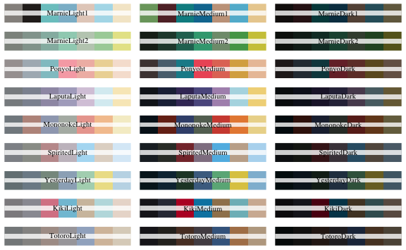

R Stuff
================
Jessica Minnier
2018-12-13

-   [visualization](#visualization)
    -   [palettes](#palettes)
-   [data summary](#data-summary)

visualization
=============

palettes
--------

-   studio gihbli palettes [ewenme/ghibli](https://github.com/ewenme/ghibli)

data summary
============

-   `skimr` package
-
