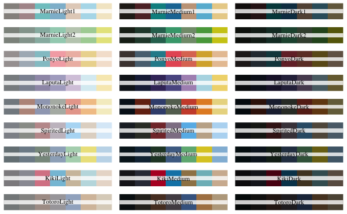

R Stuff
================
Jessica Minnier
2019-03-27

<!-- The .md file is generated from a .Rmd file, please edit the .Rmd file! -->

# r markdown

  - tabs: `## title {.tabset .tabset-fade}` in tab header ([stack
    overflow
    q](https://stackoverflow.com/questions/38062706/rmarkdown-tabbed-and-untabbed-headings))
  - [Alison Hill’s slides on
    `xaringan`](https://arm.rbind.io/slides/xaringan.html) from
    Rstudio::conf2019 Advanced R Markdown (so many good tips\!\!)

# visualization

## palettes

  - studio gihbli palettes
    [ewenme/ghibli](https://github.com/ewenme/ghibli)

## ggplot themes

  - ggthemes

# data summary

  - `skimr` package
  - `summarytools`
    [dcomtois/summarytools](https://github.com/dcomtois/summarytools)

### Data Frame Summary

**iris**  
**N:** 150

<table>
<colgroup>
<col style="width: 4%" />
<col style="width: 14%" />
<col style="width: 24%" />
<col style="width: 19%" />
<col style="width: 20%" />
<col style="width: 8%" />
<col style="width: 9%" />
</colgroup>
<thead>
<tr class="header">
<th>No</th>
<th>Variable</th>
<th>Stats / Values</th>
<th>Freqs (% of Valid)</th>
<th>Text Graph</th>
<th>Valid</th>
<th>Missing</th>
</tr>
</thead>
<tbody>
<tr class="odd">
<td>1</td>
<td>Sepal.Length 
[numeric]</td>
<td>mean (sd) : 5.84 (0.83) 
min &lt; med &lt; max : 
4.3 &lt; 5.8 &lt; 7.9 
IQR (CV) : 1.3 (0.14)</td>
<td>35 distinct values</td>
<td></td>
<td>150 
(100%)</td>
<td>0 
(0%)</td>
</tr>
<tr class="even">
<td>2</td>
<td>Sepal.Width 
[numeric]</td>
<td>mean (sd) : 3.06 (0.44) 
min &lt; med &lt; max : 
2 &lt; 3 &lt; 4.4 
IQR (CV) : 0.5 (0.14)</td>
<td>23 distinct values</td>
<td></td>
<td>150 
(100%)</td>
<td>0 
(0%)</td>
</tr>
<tr class="odd">
<td>3</td>
<td>Petal.Length 
[numeric]</td>
<td>mean (sd) : 3.76 (1.77) 
min &lt; med &lt; max : 
1 &lt; 4.35 &lt; 6.9 
IQR (CV) : 3.5 (0.47)</td>
<td>43 distinct values</td>
<td></td>
<td>150 
(100%)</td>
<td>0 
(0%)</td>
</tr>
<tr class="even">
<td>4</td>
<td>Petal.Width 
[numeric]</td>
<td>mean (sd) : 1.2 (0.76) 
min &lt; med &lt; max : 
0.1 &lt; 1.3 &lt; 2.5 
IQR (CV) : 1.5 (0.64)</td>
<td>22 distinct values</td>
<td></td>
<td>150 
(100%)</td>
<td>0 
(0%)</td>
</tr>
<tr class="odd">
<td>5</td>
<td>Species 
[factor]</td>
<td>1. setosa 
2. versicolor 
3. virginica</td>
<td>50 (33.3%) 
50 (33.3%) 
50 (33.3%)</td>
<td>IIIIIIIIIIIIIIII 
IIIIIIIIIIIIIIII 
IIIIIIIIIIIIIIII</td>
<td>150 
(100%)</td>
<td>0 
(0%)</td>
</tr>
</tbody>
</table>

## data dictionary

  - [Jennifer Thompson’s Data Dictionary
    example](https://gist.github.com/jenniferthompson/1e6059569214807bbc7db472ff117442)

# Analysis

## table 1

  - [compareGroups
    package](https://cran.r-project.org/web/packages/compareGroups/vignettes/compareGroups_vignette.html)

## survival

  - [SurvivalAnalysis
    package](https://cran.r-project.org/web/packages/survivalAnalysis/vignettes/univariate.html)

## missing data

  - [misscompare](https://cran.r-project.org/web/packages/missCompare/vignettes/misscompare.html)

# Helper functions

  - [tidytidbits](https://cran.r-project.org/web/packages/tidytidbits/readme/README.html)
  - [emilelagour/lamisc](https://github.com/emilelatour/lamisc) - in
    development, I’ve been using `pvalr()` function for formatting
    p-values
