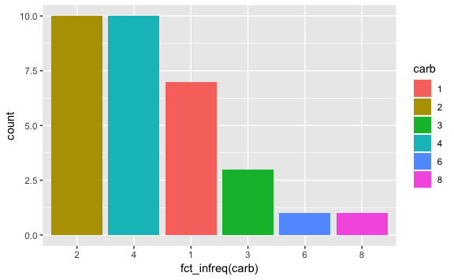

Tidyverse functions that I always forget
================
Jessica Minnier
2019-05-10

<!-- The .md file is generated from a .Rmd file, please edit the .Rmd file! -->

  - [`tibble::enframe()`](https://tibble.tidyverse.org/reference/enframe.html)
    converts a named vector to a tibble and `tibble::deframe()` does the
    opposite
  - [`forcats::fct_infreq()`](https://forcats.tidyverse.org/reference/fct_inorder.html)
    reorders a character or factor column in place, and can be used in
    ggplot:
    
